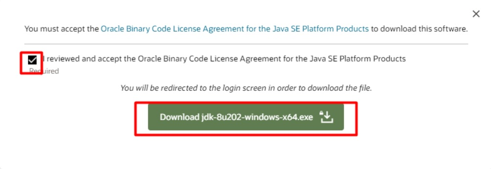
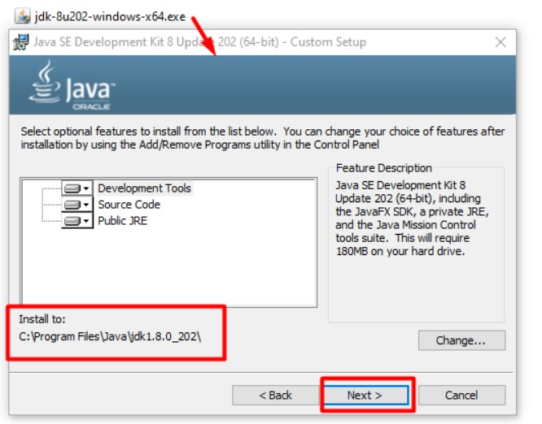
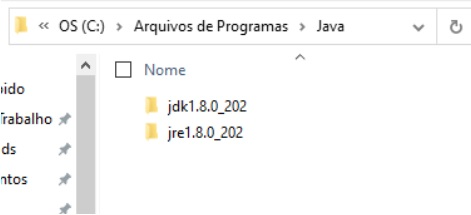
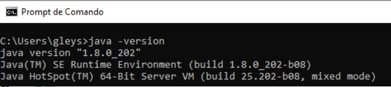
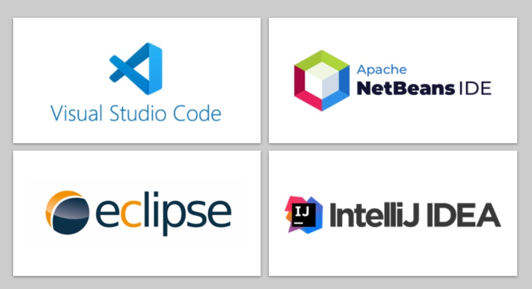

# 📌 **Ambiente de Desenvolvimento Java**

## ✅ **Configurando o ambiente**
Para começar a desenvolver em Java, é necessário que tenhamos o JDK instalado.

> É extremamente relevante, determinar a versão do Java que precisa utilizar diante de alguns requisitos do projeto.

 

### **Instalando o JDK no Windows**

> Algumas IDEs como o **VSCode** já consegue baixar e instalar o JDK e realizar a configuração de forma fácil.

- Busque no Google por Java JDK xxx (versão desejada);

- Selecione a opção .exe de acordo com o seu sistema operacional. No meu exemplo eu baixei a versão: jdk-8u202-windows-x64.exe.

 

 

- Depois, você precisará realizar um login no site da Oracle.

 

 

- Após realizar o download, executar o instalador para instalar o Java no Windows. Este processo instalará tanto o JDK quanto a JRE.

 

 

> Evite mudar o diretório de instalação.

- Em seu explorer, deve ter algo mais ou menos assim:

 

 

- Precisamos agora, validar se a instalação também já configurou nossa variável de ambiente, para poder executar o Java pelo Prompt de comando ou PowerShell do Windows.

- Abra o Prompt de comando e execute o comando java -version.

 

 

> Não iremos configurar as variáveis de ambiente, pois não é um pré-requisito para desenvolver em Java, considerando que iremos usufruir das mais poderosas IDEs para aumentar nossa produtividade em codificar na linguagem.

 

## ✅ **Escolha sua IDE**
Para aumentar nossa produtividade, nós podemos escolher algumas ferramentas denominadas de IDE - Integrated Development Environment ou Ambiente de Desenvolvimento Integrado. É um software que dispõe de recursos que auxiliam muito nosso desenvolvimento, como:

- Aceleração de nossa escrita com Auto-complete ou IntelliSense;
- Formatação de palavras e blocos de códigos;
- Análise de erro de sintaxe;
- Compilação de programa;
- Depuração (acompanhamento) de execução do programa.

Cada IDE, dispõe de recursos comuns ou plugins específicos para te auxiliar na agilidade de desenvolvimento.

 

 

> Antes de escolhar sua IDE, super recomendamos realizar uma pesquisa e ter uma experiência em cada uma delas.

 

## 💻 **Eclipse**
O Eclipse IDE é uma alternativa muito comum de encontrar ambientes de desenvolvimento, principalmente pelo aspecto de uma interface simples, plugins para recursos adicionais, atalhos para operações de menu e de escrita e para quem trabalha com Java Swing, pode adicionar o plugin WindowBuilder que de dispõe de uma interface gráfica para criar as telas, gerando o código de layout para o desenvolvedor.

> Se houver algum erro, quanto a versão do Java no Eclipse, <a href="https://www.youtube.com/watch?v=CgwpdheXvls"><b>veja o vídeo pelo link</b></a>

 

## 💻 **IntelliJ**
O IntelliJ é uma plataforma de código aberto, para criação de IDEs e ferramentas para desenvolvedores, mas nem todos os recursos estão disponíveis de forma gratuita.

Mesmo com a proposta de ser inteligente, talvez em um primeiro contato, é difícil já desfrutar de todos os recursos, fazendo com que você opte por mudar ou voltar para uma IDE como o Eclipse. Claro que não podemos deixar de destacar que, muitas coisas a gente não precisa, como: Salvar aquivo, encode padrão UTF-8 e sugestões que vão surgindo ao longo das nossas interações com a ferramenta.

 

## 💻 **Visual Studio Code**
Desenvolvido pela Microsoft, é um editor de texto muito simples e interativo que conta com inúmeras extensões, temas variados e integração com tecnologias como NodeJS e Java.

Comparando-se em performance, o VS Code demonstra um grande desempenho de inicialização, codificação e execução dos programas desenvolvidos.

 

Resumindo:

- **Eclipse:** Mais utilizada no ambiente corporativo com interface bem interativa.

- **NetBeans:** Utilizada mais em ambiente acadêmico e com versão de menu e assistentes em português.

- **IntelliJ:** Ofereçe muitos recursos de inteligência para agilidade de nosso desenvolvimento, com sugestões de ações bem assertivas.

- **VS Code:** Hoje é muito utilizada por desenvolvedores que já atuam com NodeJs ou plataformas de front-end.

 

### **Atalhos**
Todas as IDEs possuem combinações de comandos que são facilitadores para criação de arquivo, digitação de códigos, localização e execução das classes em nosso programa, além de comandos já pré-definidos de linhas de código (code snippet).

> Code Snippets, numa tradução livre seria algo como “retalhos de código”, são pedaços de código pré-fabricados e parametrizáveis que podemos inserir em nossa aplicação.

 

### **Comparação de alguns atalhos**

| <h3 align="center"><b>Comando</b></h3> | <h3 align="center"><b>Eclipse</b></h3> | <h3 align="center"><b>IntelliJ</b></h3> |
| --- | --- | --- |
| Cria o método principal main | main, ctrl + espaço, enter | psvm |
| Localiza recurso \ arquivo | ctrl + shit + R | ctrl+shift + N |
| Método de impressão no Console | sysout, ctrl + espaço | sout |
| Renomeando variável ou método | alt+shift+R | shift + F6 |
| Localizar a utilização de um método | ctrl+shift+G | alt + F7 |
| Entrar na implementação do método | ctrl+click | ctrl+click |

 

## 🔎 **Referências**

- https://www.youtube.com/watch?v=vim1bTa-Bkc

- https://blog.algaworks.com/atalhos-e-configuracoes-para-ganhar-produtividade-com-eclipse/

- https://www.w3big.com/pt/eclipse/eclipse-shortcuts.html#gsc.tab=0

- https://medium.com/@francisco.kindermann/alguns-atalhos-do-eclipse-65ad47eec6ae

- http://www.basef.com.br/index.php/Atalhos_do_IntelliJ_Idea