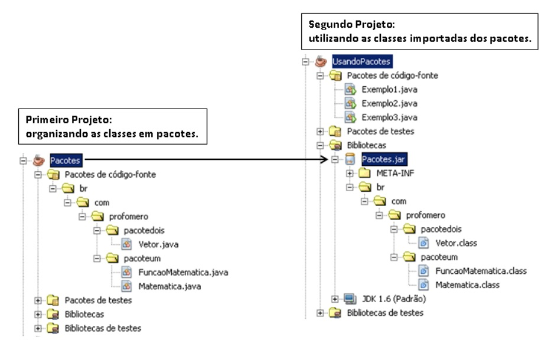

## 📝 Aula 04: Pacotes
A linguagem Java, é composta por milhares de classes, com as finalidades de por exemplo: Classes de tipos de dados, representação de texto, números, datas, arquivos e diretórios, conexão com banco de dados, entre outras. Imagina todas estas classes, existindo em um único nível de documentos? E as classes desenvolvidas por nós, meros desenvolvedores, de aplicações de vários os gêneros? Imagina como ficaria este diretório hein!?


Para prevenir este acontecimento, a linguagem dispõe de um recurso, que organiza as classes padrões criadas por nós, que conhecemos como pacote (package). Os pacotes são subdiretórios, a partir da pasta src do nosso projeto, onde estão localizadas, as classes da linguagem e novas que forem criadas para o projeto. Existem algumas convenções para criação de pacotes já utilizadas no mercado.



### Nomenclatura
Vamos imaginar, que sua empresa se chama Power Soft e ela está desenvolvendo software comercial, governamental e um software livre ou de código aberto. Abaixo teríamos os pacotes sugeridos conforme tabela abaixo:

- Comercial : com.powersoft;
- Governamental : gov.powersoft;
- Código aberto: org.powersoft.

Bem, acima já podemos perceber que existe uma definição, para o uso do nome dos pacotes, porém, podemos organizar ainda mais um pouco as nossas classes, mediante a proposta de sua existência:

- model : Classes que representam a camada e modelo da aplicação : Cliente, Pedido, NotaFiscal, Usuario;
- repository: Classes ou interfaces que possuem a finalidade de interagir com tabelas no banco de dados: ClienteRepository;
- service: Classes que contém regras de negócio do sistema : ClienteService possui o método validar o CPF, do cliente cadastrado;
- controller: Classes que possuem a finalidade de, disponibilizar os nossos recursos da aplicação, para outras aplicações via padrão HTTP;
- view: Classes que possuem alguma interação, com a interface gráfica acessada pelo usuário;
- util: Pacote que contém, classes utilitárias do sistema: FormatadorNumeroUtil, ValidadorUtil.

### Identificação
Uma das características de uma classe é a sua identificação: Cliente, NotaFiscal, TituloPagar. Porém quando esta classe é organizada por pacotes, ela passa a ter duas identificações. O nome simples (próprio nome) e agora o nome qualificado (endereçamento do pacote + nome), exemplo: Considere a classe Usuario, que está endereçada no pacote com.controle.acesso.model, o nome qualificado desta classe é com.controle.acesso.model.Usuario.

### Package versus Import
A localização de uma classe é definida pela palavra reservada package, logo, uma classe só contém, uma definição de package no arquivo, sempre na primeira linha do código. Para a utilização de uma classe existente em outros pacotes, necessitamos realizar a importação das mesmas, seguindo a recomendação abaixo:
```
package

import ... 
import ...

public class MinhaClasse {
}
```

### Por que é tão importante compreender de pacotes?
A linguagem Java, é composta por milhares de classes internas, classes desenvolvidas em projetos disponíveis através de bibliotecas e as classes do nosso projeto. Logo, existe uma enorme possibilidade da existência de classes de mesmo nome.

É nesta hora, que nós desenvolvedores precisamos detectar, qual classe iremos importar em nosso projeto.

Um exemplo clássico é, a existência das classes java.sql.Date e java.util.Date da própria linguagem, recomendo você leitor, pesquisar sobre a diferença das duas classes.