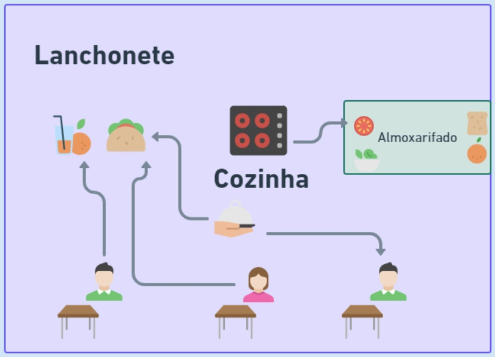
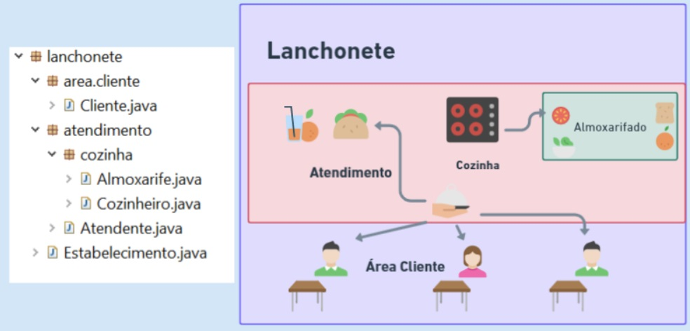

## 📝 Aula 05: Visibilidade dos recursos
### Modificadores
Em Java, utilizamos três palavras reservadas e um conceito default (sem nehuma palavra reservada) para definir os quatro tipo de visibilidade de atributos, métodos e até mesmo classes, no que se refere ao acesso por outras classes. Iremos ilustrar do mais visível, ao mais restrito tipo de visibilidade nos arquivos em nosso projeto.

Para uma melhor ilustração, iremos representar os conceitos de visibilidade de recursos, através do contexto em uma lanchonete, que vende lanche natural e suco.

### Modificador public
Como o próprio nome representa, quando nossa classe, método e atributo é definido como public, qualquer outra classe em qualquer outro pacote, poderá visualizar tais recursos.



### Modificador default
O modificador default, está fortemente associado a organização das classes por pacotes, algumas implementações, não precisam estar disponíveis por todo o projeto, e este modificador de acesso, restringe a visibilidade por pacotes.

Dentro do pacote lanchonete, iremos criar dois sub-pacotes para representar a divisão do estabelecimento.

- lanchonete.atendimento.cozinha: Pacote que contém classes, da parte da cozinha da lanchonete e atendimentos.
- lanchonete.area.cliente: Pacote que contém classes, relacionadas ao espaço do cliente.



Para definir um método visível a nível de pacote, basta NÃO declarar nenhum modificador, exemplo:
```
// Cozinheiro.java

//público
public void lavarIngredientes() {
   System.out.println("LAVANDO INGREDIENTES");
}

//nível de pacote
//sem nenhuma palavra reservada de acesso
void lavarIngredientes() {
   System.out.println("LAVANDO INGREDIENTES");
}
```

### Modificador private
Depois de reestruturar nosso estabelecimento (projeto), onde temos as divisões (pacotes), espaço do cliente e atendimento, chegou a hora de uma reflexão sobre visibilidade ou modificadores de acesso.

Conhecemos as ações disponíveis nas classes Cozinheiro, Almoxarife, Atendente e Cliente, mesmo com a organização da visibilidade por pacote, será que realmente estas classes precisam ser tão explícitas?

- Será que o Cozinheiro precisa saber que\como o Almoxarife controla as entradas e saídas ?
- Que o Cliente precisa saber como o Atendente recebe o pedido, para servir sua mesa ?
- Que o Atendente precisa saber que antes de pagar, o Cliente consulta o saldo no App ?

Diante destes questionamentos, é que nossas classes precisam continuar mantendo suas ações (métodos), mas nem todas precisam ser vistas por ninguém.

> A visibilidade de recursos da linguagem não está associada a interface gráfica, mas sim, o que as classes conseguem acessar, umas das outras.😏

### Modificador protected
> Iremos explorar mais sobre este tipo de modificador de acesso, quando formos abordar a competência Pilares de POO com ênfase em Herança, OK!?